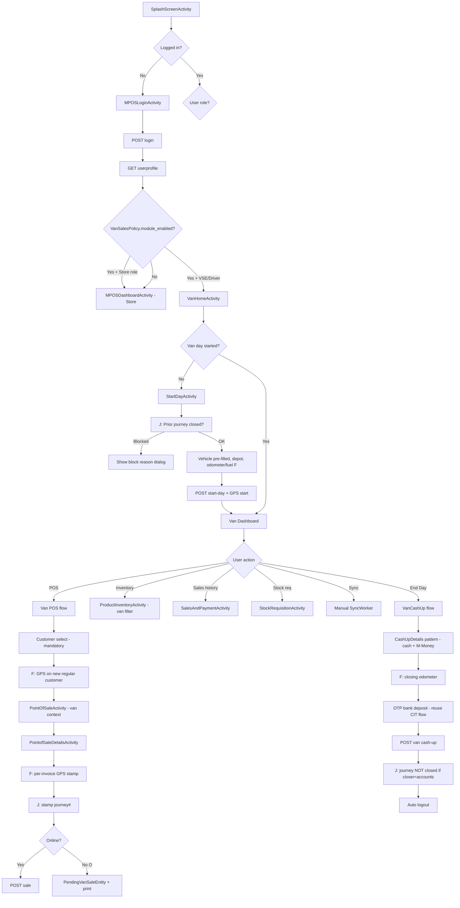

# Document 1: Van Sales — System Design

**Project:** RetailONE MPOS (`com.retailone.pos`)  
**Spec:** Kookwell Van Sales Consolidated Spec v2.1  
**Audience:** Android, backend, QA, architect  
**Status:** Working reference — greenfield Van Sales on existing store MPOS

---

## A. App Architecture Overview

### A.1 Current MPOS structure

| Layer | Location | Responsibility |
|-------|----------|----------------|
| **Application** | `MyApplication.kt` | WorkManager sync scheduling, `FeatureManager` init from `LoginSession` |
| **UI** | `ui/Activity/` | Activity-based navigation (no NavGraph); 31+ dashboard feature activities |
| **ViewModels** | `viewmodels/` | 20 ViewModels; manual `ViewModelProvider` (no Hilt) |
| **Repositories** | `repository/`, `localstorage/RoomDB/` | API + Room offline-first |
| **Network** | `network/ApiService.kt`, `ApiClient.kt` | Retrofit + Gson + `AuthInterceptor` |
| **Local DB** | `PosDatabase` (Room v26) | Pending sales/returns/replaces, product cache, offline login |
| **Background** | `SyncWorker` | 15-min periodic + network-triggered replay |
| **Feature gating** | `FeatureManager` | Org `modules[]` from login/profile (e.g. `"sales return"`, `"expense"`) |
| **Session** | `LoginSession` (DataStore) | Token, `store_id`, `cashup_date_time`, modules |

**Entry flow:** `SplashScreenActivity` → `MPOSLoginActivity` → (`FetchTOT` if totalizer) → `MPOSDashboardActivity`.

**POS hub:** Dashboard customer bottom sheet → `PointOfSaleActivity` → `PointofSaleDetailsActivity` → `sale` API / `PendingSaleEntity`.

**Day boundary (store today):** `cashup_date_time` from login; `isCashupOutdated()` blocks POS until cash-up; `CashUpActivity` → `CashUpDetailsActivity` → `submitcashup` + CIT OTP (`sendotptocit` / `verifycitotp`).

### A.2 How Van Sales fits in

Van Sales is a **parallel operating mode** on the same APK, not a fork:

```
┌─────────────────────────────────────────────────────────────────┐
│                     RetailONE MPOS (single APK)                  │
├─────────────────────────────┬───────────────────────────────────┤
│   Store mode (existing)     │   Van mode (new, flag-gated)       │
│   MPOSDashboardActivity     │   VanHomeActivity (new)            │
│   store_id from login       │   van_store_id from Driver binding │
│   walk-in customer OK       │   identified customer only         │
│   cash-up = EOD             │   Start Day + Van Cash-up          │
│   FeatureManager modules    │   VanSalesPolicy + modules         │
└─────────────────────────────┴───────────────────────────────────┘
                              │
                    Shared: Room, SyncWorker pattern, Retrofit,
                    printers, localization, auth token
```

**Integration principles (from spec §3.1, §4.2):**

- Van = moving store; VSE = store in-charge; depot = warehouse.
- Reuse POS engine, stock requisition, material receiving, cash-up patterns.
- **No country branching in code** — only `VanSalesPolicy` + tenant config keys.
- Van Sales is **absent today** (no `VanSales`, `VanSalesPolicy`, GPS, journey APIs).

### A.3 Proposed package layout (Van Sales)

| Package / area | New types (indicative) |
|----------------|------------------------|
| `vansales/policy/` | `VanSalesPolicy`, `VanSalesConfigDto` |
| `vansales/session/` | `VanSessionManager` (active journey, van store, day state) |
| `vansales/ui/` | `VanHomeActivity`, `StartDayActivity`, `VanCashUpActivity`, journey screens |
| `vansales/repository/` | `VanDayRepository`, `JourneyRepository`, `VanSyncRepository` |
| `vansales/local/` | Room entities: `VanDayEntity`, `PendingVanSaleEntity`, `JourneyCacheEntity`, etc. |
| `vansales/location/` | `GpsCaptureHelper` (Play Services Location) |
| `models/VanSalesModel/` | DTOs for new APIs |

Extend — do not replace — `MPOSLoginActivity` for VSE role routing and `SyncWorker` for van pending queues.

---

## B. Screen Flow Map

### B.1 Legend

| Symbol | Meaning |
|--------|---------|
| `[F]` | Feature flag gates branch |
| `[O]` | Offline-capable path (`enable_offline_sync`) |
| `[J]` | Journey module required (`enable_journey_module`) |

### B.2 Full journey: login → end day



### B.3 Branch matrix

| Decision point | Condition | Outcome |
|----------------|-----------|---------|
| Post-login landing | `vansales.module_enabled` + role VSE | `VanHomeActivity` |
| Post-login landing | Module off or store manager role | `MPOSDashboardActivity` |
| Start Day allowed | `[J]` open journey exists | Block with message (e.g. awaiting Accounts closure) |
| Start Day allowed | `[J]` no approved requisition | Block until approved journey/requisition |
| POS entry | Day not started | Redirect to `StartDayActivity` |
| POS entry | `require_identified_customer` | Hide walk-in / skip; force customer capture |
| Customer capture | `[F] enable_gps_capture` + regular customer | Capture lat/long on master |
| Sale submit | `[F] enable_gps_capture` | Attach coordinates to invoice payload |
| Sale submit | `[O]` offline | Queue locally; show offline invoice ID |
| Sale submit | `[J]` | Include `journey_id` / requisition# on payload |
| End Day | `[J]` + `journey_closer_role=accounts` | Cash-up completes van day only; journey stays open |
| End Day | Uganda / journey off | Cash-up closes business day (like store) |
| Dashboard cards | `FeatureManager` + van modules | Hide store-only cards on van home |
| Sync | `[O]` | Extended `SyncWorker` replays van entities |

### B.4 Journey module sub-flow (Mozambique — 13 steps, MPOS touchpoints)

| Step | Actor | MPOS screen / behaviour |
|------|-------|-------------------------|
| 1–2 | VSE / Manager | Portal — requisition create/approve (MPOS: view status) |
| 3–4 | WH Manager / VSE | Material receiving / stock verify → state Loaded |
| 5 | VSE | **Start Day** → state In Progress |
| 6 | VSE | Van POS (sales only in In Progress) |
| 7 | VSE | Top-up requisition `[F] allow_top_up_requisition` |
| 8–9 | VSE / WH Manager | Return flow — VSE blocked from sales return if `sales_return_actor=warehouse_mgr` |
| 10–12 | System / VSE / Accounts | Reconciliation, payment settlement on MPOS |
| 13 | Accounts | Portal closure — MPOS shows block until Closed |

---

## C. Data Flow

### C.1 Per-screen data contract

| Screen | Fetch (API / local) | Store locally | Sync back |
|--------|---------------------|---------------|-----------|
| **Login** | `login`, `userprofile` | Token, modules, `UserEntity`, van config blob | — |
| **Van Home** | `van/session`, `van/day-status` | `VanDayEntity`, journey summary | — |
| **Start Day** | Depots list, vehicle binding, `[J]` journey detail, `[F]` routes | `VanDayEntity` (odometer, fuel, depot, GPS start) | `POST vansales/start-day` |
| **Van POS – products** | `searchstoreproduct` (van `store_id`) | `StoreProductEntity` (scoped by van store) | — |
| **Van POS – customer** | `getcustomer` | `CustomerLocalHelper` + GPS fields in Room | `addcustomer` (+ coords if flagged) |
| **Van POS – sale** | `addtocart` (optional online) | `PendingVanSaleEntity` / stock decrement cache | `POST sale` (van + journey + GPS fields) |
| **Sales history** | `saleslist`, offline merge | `PaymentInvoiceEntity`, `SalesDetailsEntity` | — |
| **Product inventory** | `storestocks` | `ProductInventoryEntity` | `updatestocks` |
| **Stock requisition** | Existing APIs | Existing pending patterns | `submitstockrequisition` |
| **Van Cash-up** | `cashupdetails` (van-scoped) | Cash-up draft | `submitcashup` + OTP endpoints |
| **Manual sync** | — | Read pending queues | All `PendingVan*` via `SyncWorker` |

### C.2 Session vs store context

| Data element | Store mode today | Van mode proposed |
|--------------|------------------|-------------------|
| Primary store key | `LoginSession.storeID` | `VanSessionManager.vanStoreId` (from driver→vehicle→van-store binding) |
| Manager ID | `store_manager_id` | Same user id; role VSE |
| Day anchor | `cashup_date_time` | `van_day_started_at` + server `van_day_id` |
| Active journey | — | `journey_id` / requisition# in `VanSessionManager` |
| Policy | `FeatureManager` modules | `VanSalesPolicy` + modules |

### C.3 Sync-back summary

```
MPOS action          → Local queue (if offline)     → Server endpoint
─────────────────────────────────────────────────────────────────────────
Start Day            → PendingVanDayEntity          → POST vansales/start-day
Sale                 → PendingVanSaleEntity         → POST sale (van fields)
Customer add         → PendingCustomerEntity        → POST addcustomer
Cash-up              → PendingVanCashupEntity       → POST vansales/cash-up
Stock requisition    → (existing)                   → submitstockrequisition
Material receive     → (existing)                   → receivematerialsnew
GPS heartbeat (opt)  → PendingGpsEventEntity        → POST vansales/gps-events
```

---

## D. Feature Flag System — VanSalesPolicy

### D.1 Configuration source

| Source | When loaded | Persistence |
|--------|-------------|---------------|
| Tenant config API | Login + profile refresh | DataStore `van_sales_config_json` |
| Org modules | `userprofile.organization.modules` | `LoginSession` / `FeatureManager` |
| Version audit | Server-side | Config version in API for audit |

**Service contract (spec §4.2):**

```kotlin
interface VanSalesPolicy {
    fun isModuleEnabled(): Boolean
    fun requireIdentifiedCustomer(): Boolean
    fun isJourneyEnabled(): Boolean
    fun isGpsCaptureEnabled(): Boolean
    fun isRoutePlanningEnabled(): Boolean
    fun captureOdometer(): Boolean
    fun captureFuelLevel(): Boolean
    fun isOfflineSyncEnabled(): Boolean
    fun incentiveSource(): IncentiveSource // KOOKWELL | ERP
    fun isDepositManagementEnabled(): Boolean
    fun trackExclusivity(): Boolean
    fun salesReturnActor(): SalesReturnActor // VSE | WAREHOUSE_MGR
    fun journeyCloserRole(): JourneyCloserRole // ACCOUNTS | MANAGER | VSE
    fun showIncentiveHintMpos(): Boolean
    fun allowTopUpRequisition(): Boolean
}
```

### D.2 Flag → screen / behaviour map

| Config key | Policy method | Screens / behaviour affected |
|------------|---------------|------------------------------|
| `vansales.module_enabled` | `isModuleEnabled()` | Login routing; all van UI hidden if false |
| `vansales.require_identified_customer` | `requireIdentifiedCustomer()` | Van POS customer sheet; hide walk-in |
| `vansales.enable_journey_module` | `isJourneyEnabled()` | Start Day gate; POS stamp; top-up; journey status UI |
| `vansales.enable_gps_capture` | `isGpsCaptureEnabled()` | `NewCustomerRegisterActivity`; sale payload; permissions |
| `vansales.enable_route_planning` | `isRoutePlanningEnabled()` | Start Day route picker |
| `vansales.capture_odometer` | `captureOdometer()` | Start Day, Van Cash-up |
| `vansales.capture_fuel_level` | `captureFuelLevel()` | Start Day |
| `vansales.enable_offline_sync` | `isOfflineSyncEnabled()` | All van write paths → Room queue; SyncWorker |
| `vansales.incentive_source` | `incentiveSource()` | Invoice/payment hint (Kookwell only) |
| `vansales.enable_deposit_management` | `isDepositManagementEnabled()` | Portal only (Accounts); MPOS cash-up handover |
| `vansales.track_exclusivity` | `trackExclusivity()` | Portal distributor master (N/A MPOS) |
| `vansales.sales_return_actor` | `salesReturnActor()` | Goods return / sales return — role gate |
| `vansales.journey_closer_role` | `journeyCloserRole()` | End Day messaging; journey remains open |
| `vansales.show_incentive_hint_mpos` | `showIncentiveHintMpos()` | Sales payment / cash-up summary |
| `vansales.allow_top_up_requisition` | `allowTopUpRequisition()` | Journey mid-trip requisition UI |

### D.3 Coexistence with FeatureManager

| Concern | Approach |
|---------|----------|
| Org module `"van sales"` | Gate van entry point on dashboard/login (like `"expense"`) |
| VanSalesPolicy | All van-specific behavioural branching |
| Store POS | Unchanged when `module_enabled` false or user in store role |
| Mid-session config change | Read policy on each screen `onResume`; in-flight transactions use flags at start |

---

## E. Offline Sync Design

### E.1 Local DB schema (extensions to Room)

**New entities (proposed):**

| Entity | Table | Purpose |
|--------|-------|---------|
| `VanSalesConfigEntity` | `van_sales_config` | Cached tenant policy JSON + version |
| `VanDayEntity` | `van_day` | Active day: depot, odometer, fuel, started_at, status |
| `JourneyCacheEntity` | `journey_cache` | Journey#, state, approved lines snapshot |
| `PendingVanSaleEntity` | `pending_van_sales` | Extends sale pattern; adds `journey_id`, `lat`, `lng` |
| `PendingVanDayEntity` | `pending_van_day` | Offline start-day |
| `PendingVanCashupEntity` | `pending_van_cashup` | Offline cash-up |
| `PendingCustomerEntity` | `pending_customers` | Customer + GPS offline |
| `PendingGpsEventEntity` | `pending_gps_events` | Optional audit trail |
| `VanProductCacheEntity` | `van_products` | Van-store scoped catalog (optional denorm) |

**Reuse existing:** `StoreProductEntity`, `PaymentInvoiceEntity`, `UserEntity`, `StoreSettingsEntity` — keyed by `van_store_id` when in van mode.

**Migration:** Increment `PosDatabase` version; prefer typed migrations over `fallbackToDestructiveMigration()` for production van deployments.

### E.2 Sync queue design

```
┌──────────────┐     write      ┌─────────────────┐     network    ┌──────────┐
│ Van UI       │ ─────────────► │ Pending* DAO    │ ─────────────► │ Backend  │
│ Activities   │                │ sync_status     │   SyncWorker   │ APIs     │
└──────────────┘                └─────────────────┘                └──────────┘
                                       │
                                       ▼
                                PENDING → SYNCING → SYNCED | FAILED
```

**Ordering (FIFO per entity type):**

1. `PendingVanDayEntity` (start day before sales)
2. `PendingCustomerEntity`
3. `PendingVanSaleEntity`
4. `PendingVanCashupEntity`
5. `PendingGpsEventEntity`

**Orchestration:** Extend `SyncWorker.doWork()` mirroring `PosSaleRepository.syncOfflineSales()` pattern.

### E.3 Conflict resolution

| Conflict type | Strategy |
|---------------|----------|
| **Invoice ID collision** | Server assigns canonical ID on sync; remap local `OFF_*` → server ID (existing `PosSaleRepository` pattern) |
| **Stock oversell offline** | Server rejects → mark `FAILED`, show user resolution; optional `PendingActionRevertUtil`-style stock rollback |
| **Duplicate start day** | Server idempotent by `van_store_id` + business date → accept or return existing `van_day_id` |
| **Journey state mismatch** | Server wins; refresh `JourneyCacheEntity`; block POS if journey not In Progress |
| **Customer duplicate mobile** | Server merge or reject with message; keep local until resolved |
| **Cash-up amount mismatch** | No auto-merge; `FAILED` + supervisor review |
| **Config version drift** | On sync bootstrap, pull latest `VanSalesConfig`; stale policy does not invalidate in-flight queue |

### E.4 Offline operating mode (Mozambique)

When `enable_offline_sync=true`:

- Login: cache van catalog, customers, journey snapshot, policy.
- Reads: served from Room where possible.
- Writes: always enqueue first if no network; optimistic UI + print.
- UI: global offline indicator on `VanHomeActivity` (reuse `NetworkUtils`).
- Store switch: extend `ActiveStoreHelper` / `OfflineDataResetUtil` for van store vs depot context.

---

## References (codebase anchors)

| Area | File |
|------|------|
| Dashboard / gating | `MPOSDashboardActivity.kt` |
| Feature flags | `FeatureManager.kt` |
| Offline sales | `PosSaleRepository.kt`, `PendingSaleEntity.kt` |
| Sync | `SyncWorker.kt` |
| Cash-up OTP | `CashUpDetailsActivity.kt`, `ApiService.kt` |
| Room DB | `PosDatabase.kt` |
| Login session | `LoginSession.kt` |
